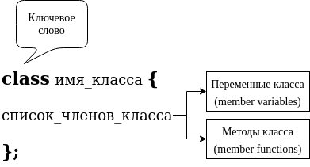
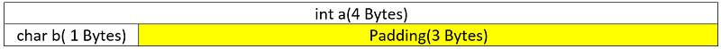
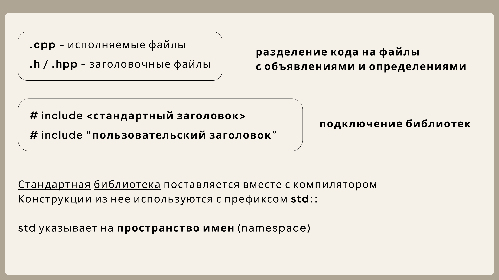
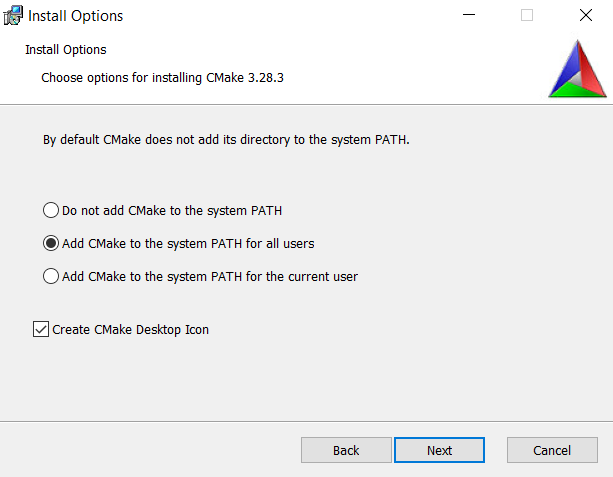
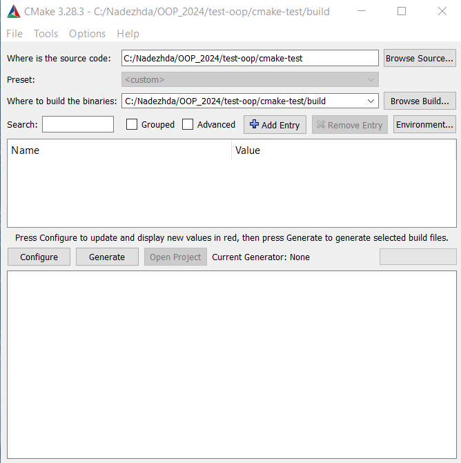
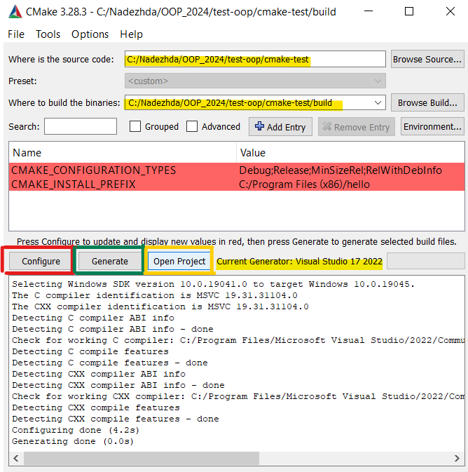
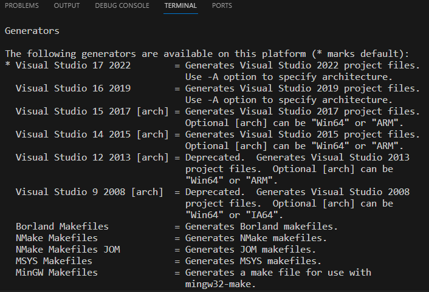
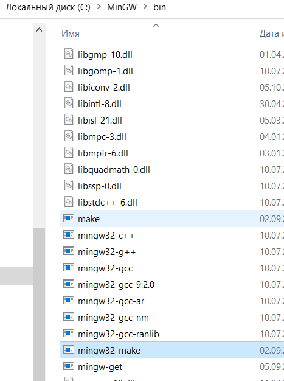

# Введение в ООП, знакомство с классами, CMake

## Парадигмы программирования

Парадигмы программирования — это основные подходы и стили, которые определяют, как разрабатываются программы и как организуется код. Каждая парадигма имеет свои принципы, концепции и методы, которые помогают разработчикам решать задачи и структурировать код.

### Императивный подход
Последовательно, шаг за шагом выполнение кода

```c++
#include <iostream>

int main() {
    int sum = 0;
    for (int i = 1; i <= 10; ++i) {
        sum += i; // Изменение состояния переменной
    }
    std::cout << "Sum: " << sum << std::endl;
    return 0;
}

```

### Процедурное программирование
Следующее, что можно сделать после опсиание действий шаг за шагов, это выделить в функции

```c++
#include <iostream>
#include <vector>

void calculateSquares(const std::vector<int>& numbers, std::vector<int>& squares) {
    for (int num : numbers) {
        squares.push_back(num * num); // Изменение состояния переменной squares
    }
}


int main() {
    std::vector<int> numbers = {1, 2, 3, 4, 5};
    std::vector<int> squares; // Вектор для хранения квадратов

    calculateSquares(numbers, squares); // Вызов процедуры для вычисления квадратов

}

```

### Функциональное программирование
Думаем профункции, как про математические, не изменяем состояние внутри, но гарантируем при одинаковых входных данных - одинаковый результат.

Собираем код из фукнций, как из кирпичиков

```c++
#include <iostream>
#include <vector>
#include <algorithm> /

// Чистая функция для вычисления квадрата
int square(int num) {
    return num * num; 
}

int main() {
    std::vector<int> numbers = {1, 2, 3, 4, 5};
    std::vector<int> squares(numbers.size()); 
    std::transform(numbers.begin(), numbers.end(), squares.begin(), square);
}

```

### Декларативный подход
Описываем, что должно быть сделано, в не как

```c++
#include <iostream>
#include <vector>
#include <algorithm>

int main() {
    std::vector<int> numbers = {1, 2, 3, 4, 5};
    int sum = std::accumulate(numbers.begin(), numbers.end(), 0); // Декларативный подход
    std::cout << "Sum: " << sum << std::endl;
    return 0;
}

```

## ООП - Объектно-ориентированное программирование  

Объектно-ориентированное программирование(ООП) подразумевает описание информационной модели взаимодействия объектов, которые могут содержать данные и алгоритмы. Данные представляются как поля (свойства, атрибуты), а алгоритмы — как процедуры или функции (методы).  

Основными принципами ООП являются:
* *Абстракция* - программный подход,
полагающийся на разделение интерфейса (interface) и реализации
(implementation). Интерфейс класса состоит из операций, которые
пользователь класса может выполнить с его объектом.

* *Инкапсуляция* - возможность включения и сокрытия информации об объекте, такой как внутренняя структура данных и код. Инкапсуляция изолирует овать внутреннюю реализацию объекта от остального приложения. 

* *Наследование* - способность наследуемого класса приобретать характеристики базового класса. Если характеристики базового класса меняются, класс, который базируется на нём наследует эти характеристики.  

* *Полиморфизм* - в переводе с гречесткого - множество форм  
Overloading: Способность родственных классов иметь методы с теми же именами, но различным содержанием.  
Overriding: Когда используемая процедура определяется во время выполнения в зависимости от класса (типа) объекта.
 
## Структуры и Классы

В языке C структуры (struct) используются для группировки связанных данных под одним именем

```c++
// Определение структуры для хранения информации о человеке
struct Person {
    char name[50]; // Массив символов для имени
    int age;       // Целочисленный член для возраста
};
```

Классы в языке С++ *используются для определения собственных типов
данных.* Определение типов, отражающих концепции решаемых задач,
позволяет существенно упростить написание, отладку и модификацию
программ.

Класс определяет:
 * тип данных и набор операций, связанных с этим типом

```c++
#include <iostream>
#include <string>

class Person {
public:
    // Конструктор
    Person(const std::string& name, int age) : name(name), age(age) {}

    // Метод для отображения информации о человеке
    void displayInfo() const {
        std::cout << "Name: " << name << ", Age: " << age << std::endl;
    }

private:
    std::string name; // Член данных
    int age;          // Член данных
};

int main() {
    Person person("Alice", 30);
    person.displayInfo(); // Вывод: Name: Alice, Age: 30
    return 0;
}
```

## Структура отличается от класса отсутствием *инварианта*

Инвариант класса в C++ — это множество условий, сохраняющих свою истинность на протяжении всего времени жизни экземпляра класса

**Пример инварианта для класса vector**: номер текущего элемента не должен быть больше общего количества элементов и не должен быть меньше нуля. 

В C++ структура на уровне кода почти не отличается от класса, однако:  
* Структура по умолчанию публичная, а класс приватный
* О структуре лучше думать как о наборе данных
* Не имеет инварианта

```c++
#include <iostream>
#include <string>

struct Person {
    // Члены данных
    std::string name;
    int age;

    // Метод для отображения информации о человеке
    void displayInfo() const {
        std::cout << "Name: " << name << ", Age: " << age << std::endl;
    }
};

int main() {
    Person person; // Создание экземпляра структуры
    person.name = "Bob";
    person.age = 25;
    person.displayInfo(); // Вывод: Name: Bob, Age: 25
    return 0;
}
```

##  <a id="oop1"></a>ООП - конструкторы и деструкторы

### Конструктор

Конструктор в C++ - это специальный метод, который вызывается автоматически во время создания объекта. Обычно он используется для инициализации элементов данных новых объектов. Конструктор в C++ имеет то же имя, что и класс или структура. Он создает значения, т.е. предоставляет данные для объекта, поэтому он известен как конструктор.

Виды конструкторов:
* Конструктор по умолчанию - все параметры инициализируются значениями по умолчанию 

```
MyClass object;
```

* Конструктор с параметрами - чтобы инициализировать поля класса
```
MyClass object(3);
```

Модификатор **explicit** запрещает неявное преобразование
```c++
MyClass object = 3; //не получится неявно преобразовать int в тип MyClass
```

* Конструктор копирования - поля нового объекта инициализируются полями другого объекта 
того класса

```
Rational::Rational(const Rational& other)
    : num(other.num)
    , denum(other.denum)
{}
```

Инициализация полей **в списке инициализации**:
```
Box(int width, int length, int height)
        : m_width(width), m_length(length), m_height(height)
    {}
```

Перед телом функции появились двоеточие и код между ним и фигурными скобками, обозначающими пустые тела функции. Список инициализации определяет исходные значения для одного или нескольких полей создаваемого объекта. 

### Деструктор 
Конструктор + деструктор = функциональное замыкание    
Обычно вызывается компилятором неявно при уничтожении объекта  

```
~MyClass() = default;
```

## RAII - Resource Acquisition Is Initialization
### Получение ресурса есть инициализация

Идиома ООП, смысл которой в том, что с помощью тех или иных программных механизмов получение некоторого ресурса неразрывно совмещается с инициализацией, а освобождение — с уничтожением объекта

1. Инкапсулируем ресурсы в класс (на моменте вызова конструктора)
2. Пользуемся ресурсами через объект класса
3. Ресурсы автоматически освобождаются, когда объект выходит из области видимости (вызывается деструктор)

## Из чего состоит класс

 
  
---

1. Определение класса: Класс определяется с помощью ключевого слова class, за которым следует имя класса и тело класса, заключенное в фигурные скобки.

2. Поля (члены данных): Поля — это переменные, которые хранят состояние объекта. Они могут быть различных типов (например, int, float, std::string и т.д.).

3. Методы (члены функций): Методы — это функции, которые определены внутри класса и могут работать с его полями. Методы могут изменять состояние объекта или выполнять действия, связанные с объектом.

```c++
#include <iostream>
#include <string>

class Person {
public:
    std::string name; //поле
    int age; //поле

    //конструтор
    Person(const std::string& n, int a) : name(n), age(a) {}
    //деструтор
    ~Person() {}

    //метод
    void display() const {
        std::cout << "Name: " << name << ", Age: " << age << std::endl;
    }
};

int main() {
    Person p("Alice", 30); // создание объекта класса
    p.display(); // вызов метода через оператор точка
}
```

## Public, private, protected

В C++ `public`, `private` и `protected` — это спецификаторы доступа, которые определяют уровень доступа к членам данных и методам класса или структуры. Они играют важную роль в инкапсуляции и управлении доступом к данным

| Спецификатор доступа | Доступ из класса/структуры | Доступ из производных классов | Доступ из внешнего кода |
|----------------------|-----------------------------|-------------------------------|-------------------------|
| **public**           | Да                          | Да                            | Да                      |
| **private**          | Да                          | Нет                           | Нет                     |
| **protected**        | Да                          | Да                            | Нет                     |


- **Классы**: По умолчанию члены класса имеют `private` доступ.
- **Структуры**: По умолчанию члены структуры имеют `public` доступ.

```c++
class Example {
public:
    // Публичный метод
    void setName(const std::string& n) {
        name = n; // Доступ к private полю
    }

    // Публичный метод для отображения имени
    void display() const {
        std::cout << "Name: " << name << std::endl;
    }

protected:
    // Защищенное поле
    int id;

private:
    // Приватное поле
   
```

## sizeof Класс

В C++ память для полей класса выделяется в определенном порядке, и компилятор может добавлять дополнительные байты для выравнивания

### 1. Порядок выделения памяти

- **Определение порядка**: Память для полей класса выделяется в порядке их объявления в классе. Например, если у вас есть поля `int`, `double` и `char`, они будут размещены в памяти в том порядке, в котором они объявлены.
  
  ```cpp
  class MyClass {
  public:
      int a;        // 4 байта
      double b;     // 8 байт
      char c;       // 1 байт
  };
  ```

### 2. Выравнивание

- **Выравнивание**: Компиляторы часто требуют, чтобы данные были выровнены по определенным границам (например, 4 байта для `int`, 8 байт для `double`). Это означает, что адреса полей должны быть кратны размеру типа данных.
  
- **Добавление дополнительных байтов**: Если порядок полей не соответствует требованиям выравнивания, компилятор может добавить "пустые" байты (паддинг) между полями для обеспечения правильного выравнивания.

```cpp
class MyClass {
public:
    int a;        // 4 байта
    char c;       // 1 байт
    double b;     // 8 байт
};
```

- **Размеры**:
  - `int a`: 4 байта
  - `char c`: 1 байт
  - **Паддинг**: 3 байта (для выравнивания `double`)
  - `double b`: 8 байт

- **Итоговый размер**: 
  - Общий размер будет 4 (int) + 1 (char) + 3 (паддинг) + 8 (double) = 16 байт.

 

Можно объявлять поля в другом порядке, чтобы меньше памяти выделялось

```c++
class B
{
    //поля
    char m_c;
    int m_n;
    bool m_b;
    double m_d;
    
};

// Здесь выделится меньше памяти
class C
{
    //поля
    double m_d;
    int m_n;
    char m_c;
    bool m_b;
    
};
```

## Написание собственных библиотек

 

### <a id="git"></a>Напоминание базовых команд для гита

```
git status
git branch
git checkout -b <название новой ветки>
git merge <название ветки> -m "Комментарий"
```

* git status - проверка текущего состояния репозитория. На какой вы ветке, какие файлы отслеживаете, нужно ли что-то закоммитить
* git branch - проверка на какой ветке вы сейчас находитесь
* git checkout -b <название новой ветки> - создание новой ветки и сразу же переход на нее
* git merge <название ветки> -m "Комментарий" - объединить ветки (историю коммитов)


##  <a id="cmake"></a>CMake - кроссплатформенная автоматизированная система сборки проектов

Непосредственно сборкой система не занимается, а только генерирует Makefile, который потом будет выполнен утилитой make. То есть цель CMake - взять описание проекта и сгенерировать файлы конфигурации под вашу систему (с помощью которых уже потом можно будет собрать проект)

Поведение сборки определяется в файлах CMakeLists.txt - по одному в каждом каталоге исходного кода. Файл CMakeLists каждого каталога определяет, что должна делать система сборки в этом конкретном каталоге. Он также определяет, какие подкаталоги должны обрабатывать CMake.

#### Минимальный setup файла CMakeLists.txt
```
cmake_minimum_required(VERSION 3.10)

project(hello)
add_executable(hello main.cpp)
```

[Скачать CMake](https://cmake.org/download/)

  

**! Не забудьте отметить необходимость добавить в PATH, или добавьте сами**

## Использование с Visual Studio 

  

  

Чтобы подготовить проект к сборке необходимо последовательно выполнить действия:
1. Сконфигурировать (Configure)
На этом этапе CMake создает внутреннее представление вашего проекта
2. Сгенерировать (Generate)
Генератор отвечает за написание файлов для вашей системы сборки (на основе созданного в пункте 1. представления), необходимо выбрать один из генераторов, например, Visual Studio 17 2022
3. Открыть проект, по кнопке или из файлов

**!Обратите внимание, вы создали новую директорию /build, эту папку с ее содержимым нужно добавить в .gitignore и не грузить на гит**

## <a id="cmaketerm"></a>Использование с VS Code (через терминал) Windows/Linux

Можно работать с CMake непосредственно через терминал, без приложения. Именно для этого мы при установке добавляли в PATH

```
cmake --version
```
Как обычно наличие исполняемого файла можно проверить, посмотрев его версию

```
mkdir build
cd build
cmake ..
make
```

Порядок генерации файлов для сборки и непосредственно сборка очнь простой.
1. Нужно самостоятельно создать папку build
2. Перейти в нее
3. cmake .. - команда, при которой последовательно выполняется процесс конфигурации и генерации (выше их выполняли по клику на две разные кнопки) точки указывают на путь к директории где лежит главный CMakeLists.txt, в нашем случае на папку выше
4. make - команда, чтобы сбилдить проект 
На самом деле с помощью команды make выполняются инструкции в Makefile, этот файл сгенирировал CMake
* Далее можно запустить созданный main.exe

Важды два момента:
### 1.  Чтобы создался Makefile, а не, например, Solution под Visual Studio, необходимо указать параметр генератору и команду 3. выполнять немного иначе

```
cmake .. -G "MinGW Makefiles"
```

Список доступных генераторов можно посмотреть по команде 
```
cmake --help  
```
  

### 2. Нужно отдельно установить make

На Windows можно сделать так:

1. [Установить MinGW](https://sourceforge.net/projects/mingw/files/Installer/mingw-get-setup.exe/download?use_mirror=deac-riga&download=&failedmirror=kumisystems.dl.sourceforge.net) (если вы еще не скачивали компиляторы, как предлагалось на прошлом занятии)
Не забываем про PATH
2.  Установить 'mingw32-make' командой из терминала
```
mingw-get install mingw32-make
```
3. Для удобства переименовать 'mingw32-make' в 'make' 
**Не удаляйте mingw32-make** просто продублируйте, иначе cmake не найдет его

 

4. Проверить возможность вызвать из терминала make  

Вот теперь можно посльзоваться cmake из терминала, в том числе в VS Code