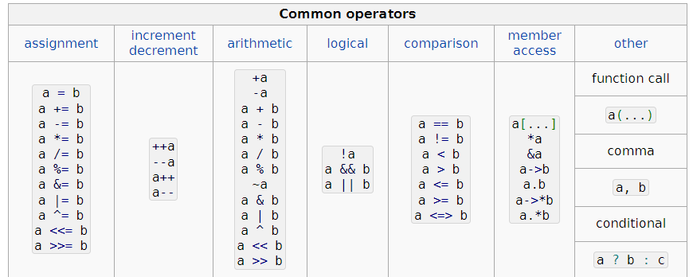

# ООП - перегрузка операторов

## Проверка себя:
* Какие есть принципы ООП?
* Чем отличается в c++ класс от структуры?
* Когда вызывается конструктор и деструктор?

### <a id="oop2"></a>[Перегрузка операторов](https://en.cppreference.com/w/cpp/language/operators)

Допускается возможность перегрузки операторов (overloading), то есть способность переопределения привычных операторов типа +, *, >, <, =, >>, <<, [], () и т.д. для своих пользовательских типов. Заранее без перегрузки компилятор никак не узнает что 'означает', к примеру, плюс для вашего типа.

Оператор - это такой же метод класса, просто имя немного необычное, например, operator+

```c++
 MyClass a;
 MyClass b;
 a = a + b;
 a.operator+(b);
```



#### Некоторые операторы можно перегружать как метод класса, так и как свободная функцию

* Как метод класса
```cpp
class MyClass{
    MyClass operator+(MyClass& other){
        // реализация
        return //объект типа MyClass
    }
};
```

* Как свободная функция вне класса
```cpp
class MyClass {
    //реализация класса
};

MyClass operator+(MyClass& lhs, MyClass& rhs) {
    return //объект типа MyClass
}
```

* Через дружественные функции (!не рекомендуется)

Ключевое слово friend используется, чтобы определить функции, дружественные для данного класса. На практике это означает, что дружественная функция имеет доступ к приватным членам класса.

```cpp
class MyClass {
public:
    friend MyClass operator+(MyClass& lhs, MyClass& rhs);
};

MyClass operator+(MyClass& lhs, MyClass& rhs) {
    return //объект типа MyClass
}
```
Почему возникла необходимость использования friend?

Перегрузка операторов через методы класса не используются, если первый операнд не является классом (например int), или это класс, который нельзя изменять (например std::ostream). Соответственно не получится через методы класса переопределить оператор <<, так как первый его операнд - специальный класс std::ostream.

```cpp
std::ostream& operator<<(std::ostream& out, const Y& y)
{
    return out << y.data; // можно получить доступ к приватному полю Y::data
}
```
**НО** использование friend рекомендуется только в крайнем случае, поэтому где можно обойтись без friend - следует это сделать. 
Здесь это можно сделать через метод класса

```cpp
class MyClass {
public:
    std::ostream& writeTo(std::ostream& ostrm) const;
};


std::ostream& operator<<(std::ostream& ostrm, const MyClass& rhs) {
    return rhs.writeTo(ostrm);
}

```

### Некоторые особенности перегрузки

* Перегружая оператор следует реализовывать функционал понятный пользователю исходя из смысла оператора. Например, operator+ для конкатенации строк
* Можно использовать операторы в привычной инфиксной форме, но также возможно и в функциональной

```c++
    N::X x, y;
    // инфиксная форма
    N::X z = x + y;
    N::X v = x – y;
    N::X w = +x;
    N::X u = -x;
    x(1,2);
    char p = x[4];
    // функциональная форма
    N::X z = x.operator+(y);
    N::X v = operator-(x, y);
    N::X w = x.operator+();
    N::X u = operator-(x);
    x.operator()(1,2);
    char p = x.operator[](4);
```
* Необходимо учитывать приоритет и ассоциативность операторов, они при перегрузке не меняются и должны соответствовать ожиданиям пользователя.

Например, оператор вывода << имеет высокий приоритет
```c++
// такая запись
std::сout << z ? x : y;

// эквивалента такой
(std::сout << z) ? x : y;


// а не такой (ожидаемой)
std::сout << (z ? x : y);

```

### Ключевое слово explicit
Ключевое слово explicit в C++ используется для указания компилятору, что конструктор или оператор преобразования должны использоваться только в явных преобразованиях типов, а не в неявных.

```c++
class MyClass {
    public:
        // Объявление явного конструктора
        explicit MyClass(int value) : data(value) {}
    private: int data;
};
```

```c++
MyClass object = 3; //не получится неявно преобразовать int в тип MyClass
```

## <a id="oop3"></a>[Google style guide](https://google.github.io/styleguide/cppguide.html)

Например, рекомендации по пробелам горизонтальным
```cpp
int i = 0;  // Two spaces before end-of-line comments.

void f(bool b) {  // Open braces should always have a space before them.
  ...
int i = 0;  // Semicolons usually have no space before them.
// Spaces inside braces for braced-init-list are optional.  If you use them,
// put them on both sides!
int x[] = { 0 };
int x[] = {0};

// Spaces around the colon in inheritance and initializer lists.
class Foo : public Bar {
 public:
  // For inline function implementations, put spaces between the braces
  // and the implementation itself.
  Foo(int b) : Bar(), baz_(b) {}  // No spaces inside empty braces.
  void Reset() { baz_ = 0; }  // Spaces separating braces from implementation.
  ...
```

# Домашнее задание
* Реализовать класс комплексные числа
```c++
#ifndef COMPLEX_COMPLEX_HPP
#define COMPLEX_COMPLEX_HPP

#include<iostream>
#include<cmath>
#include <sstream>
#include <string>
#include <limits>

struct Complex {
	Complex() = default;
	explicit Complex(const double re);
	Complex(const double re, const double im);
	~Complex() = default;

	Complex& operator+=(const Complex& rhs);
	Complex& operator-=(const Complex& rhs);
	Complex& operator*=(const Complex& rhs);
	Complex& operator/=(const Complex& rhs);

	Complex& operator+=(double rhs);
	Complex& operator-=(double rhs);
	Complex& operator*=(double rhs);
	Complex& operator/=(double rhs);

    std::ostream& writeTo(std::ostream& ostrm) const;
    std::ostream& readFrom(std::istream& istrm);

	double re{ 0.0 };
	double im{ 0.0 }; 

	static const char leftBrace{ '{' };
	static const char separator{ ',' };
	static const char rightBrace{ '}' };
};

Complex operator+(const Complex& lhs, const Complex& rhs);
Complex operator-(const Complex& lhs, const Complex& rhs);
Complex operator*(const Complex& lhs, const Complex& rhs);
Complex operator/(const Complex& lhs, const Complex& rhs);
Complex operator+(const Complex& lhs, const double rhs);
Complex operator-(const Complex& lhs, const double rhs);
Complex operator*(const Complex& lhs, const double rhs);
Complex operator/(const Complex& lhs, const double rhs);

bool operator==(const Complex& lhs, const Complex& rhs);
bool operator!=(const Complex& lhs, const Complex& rhs);
std::ostream& operator<<(std::ostream& out, const Complex& z);
std::istream& operator>>(std::istream& in, Complex& z);
#endif 
```
* Разделять объявление и реализацию на complex.hpp и complex.cpp файлы
* Добавить два любых своих метода в класс для работы с комплексными числами
* Написать complex_test.cpp - тестирование работы вашего класса через функции

