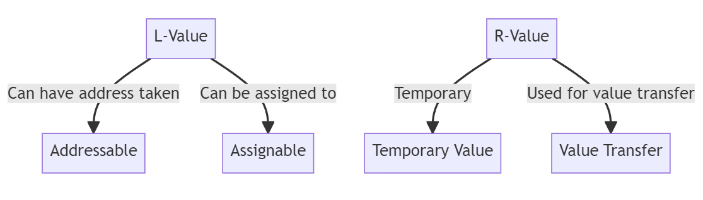

# Move-семантика, умные указатели - примеры

# Конструктор перемещения и функция std::move()

Копирование может осуществляться при многих обстоятельствах. При некоторых из них объект разрушается немедленно после копирования. В этих случаях перемещение объекта вместо копирования способно обеспечить существенное увеличение производительности.

Выражения в c++ могут быть r-value или l-value. Первоначально имели простую мнемоническую цель: l-значения могли стоять слева от оператора присвоения, а r-значения не могли. 



**l-value** обозначает объект, занимаемый адресуемое место в памяти. Обычно это переменные или ссылки, к которым мы можем что-то присвоить.

```cpp
int x = 10;  // 'x' l-value
x = 20;      // 'x' с левой стороны присваивания
```
**r-value** это временное значение, без специально определенного места в памяти. Обычно используется для инициализации r-value. 

```cpp
int y = x + 5;  // 'x + 5' r-value
```

### Ссылки на r-value
Ссылка на r-значение (r-value reference) — это ссылка, которая должна быть связана с r-value. Ссылку на r-value получают с использованием символа &&, а не &. 

```cpp
    int i = 42;
    int &r = i; // ok: r ссылается на i
    int &&rr = i; // ошибка: нельзя связать ссылку на r-значение
    // с l-значением
    int &r2 = i * 42; // ошибка: i * 42 - это rзначение
    const int &r3 = i * 42; // ok: ссылку на константу можно
    // связать с r-значением
    int &&rr2 = i * 42; // ok: связать rr2 срезультатом умножения
```
**l-значения — устойчивы; r-значения — эфемерны**

```cpp
// Конструктор перемещения
MyClass(MyClass&& other) noexcept : data(other.data) {
    other.data = nullptr; 
}
```


## Умные указатели

Начиная со стандарта C++11 появились smart pointers, определенные в заголовке *memory*:

* std::unique_ptr — умный указатель, владеющий динамически выделенным ресурсом;
* std::shared_ptr — умный указатель, владеющий разделяемым динамически выделенным ресурсом. Несколько std::shared_ptr могут владеть одним и тем же ресурсом, и внутренний счетчик ведет их учет;
* std::weak_ptr — подобен std::shared_ptr, но не увеличивает счетчик.

Умный указатель **автоматически** удаляет объект, на который он ссылается

### Рассмотрим unique_ptr

Указатель unique_ptr как бы 'владеет' (ownership) объектом, на который он указывает.

std::unique_ptr - это умный указатель, который обеспечивает эксклюзивное владение динамически выделенным ресурсом. Уникальный указатель гарантирует, что только один std::unique_ptr владеет ресурсом.   

Когда std::unique_ptr уничтожается, он автоматически освобождает выделенную память. Это позволяет избежать утечек памяти и упрощает управление ресурсами.  

* Создание указателя

```cpp
#include <memory>

// Создание std::unique_ptr для int
std::unique_ptr<int> ptr(new int(42));

// Создание std::unique_ptr для массива int
std::unique_ptr<int[]> arrPtr(new int[5]);

auto ptr = std::make_unique<int>(42);
auto arrPtr = std::make_unique<int[]>(5);

```

* Передача между функциями/методами

std::unique_ptr может передаваться между функциями или методами, как и обычные указатели
**НО** только один std::unique_ptr может владеть ресурсом. Попытка копирования приведет к ошибке компиляции. Поэтому используем std::move

```cpp
void process(std::unique_ptr<int> ptr) {
    // smth
}

int main() {
    std::unique_ptr<int> ptr(new int(42));
    process(std::move(ptr)); // Передача владения указателем

    return 0;
}

```

* Передача в функцию/метод, когда требуется обычный указатель, ссылка:

```cpp
#include <iostream>
#include <memory>


void processPtr(const int* ptr) {
    std::cout << "Value at pointer: " << *ptr << std::endl;
}


void processRef(const int& ref) {
    std::cout << "Value by reference: " << ref << std::endl;
}

int main() {
    auto ptr = std::make_unique<int>(42);

    processPtr(ptr.get());

    processRef(*ptr);
    return 0;
}

```

В функцию processPtr передается обычный указатель const int*, полученный с помощью метода get(), который возвращает указатель на управляемый объект. Внутри функции мы можем использовать этот указатель как обычный указатель на const int.

В функцию processRef передается ссылка const int&, полученная путем разыменования умного указателя *ptr. Функция processRef принимает ссылку на значение, хранящееся внутри умного указателя.

* Пример использования с вектором

```cpp
#include <iostream>
#include <vector>
#include <memory>

int main() {
    std::vector<std::unique_ptr<int>> vec;

    for (int i = 0; i < 5; ++i) {
        vec.push_back(std::make_unique<int>(i));
    }

    for (const auto& ptr : vec) {
        std::cout << *ptr << std::endl; 
    }

    return 0;
}

```

# Примеры

1. Копировать - дорого 
```cpp
#include <iostream>
#include <chrono>
#include <utility>
#include <string>

class DynamicArr {
    std::string* data;
    size_t size;

public:
    DynamicArr(size_t s) : size(s), data(new std::string[s]) {
        for (size_t i = 0; i < size; ++i) {
            data[i] = std::string(1000000, 'a'); 
        }
    }

    ~DynamicArr() {
        delete[] data;
    }

    DynamicArr(const DynamicArr& other) : size(other.size), data(new std::string[other.size]) {
        std::cout << "Copying array of " << size << " elements.\n";
        for (size_t i = 0; i < size; ++i) {
            data[i] = other.data[i];
        }
    }

    DynamicArr(DynamicArr&& other) noexcept : size(other.size), data(other.data) {
        other.data = nullptr;
        std::cout << "Moving array of " << size << " elements.\n";
    }
};


DynamicArr createArray() {
    DynamicArr arr(10); 
    return arr; 
}

int main() {
    
    auto start = std::chrono::high_resolution_clock::now();
    DynamicArr arr = createArray(); 
    DynamicArr arr1(arr); 
    auto end = std::chrono::high_resolution_clock::now();
    auto copy_duration = std::chrono::duration_cast<std::chrono::milliseconds>(end - start).count();
    std::cout << "Time taken for copy: " << copy_duration << " ms\n";


    start = std::chrono::high_resolution_clock::now();
    DynamicArr arr2 = std::move(createArray());
    end = std::chrono::high_resolution_clock::now();
    auto move_duration = std::chrono::duration_cast<std::chrono::milliseconds>(end - start).count();
    std::cout << "Time taken for move: " << move_duration << " ms\n";
}

```

2. Unique_ptr пример
```cpp
#include <iostream>
#include <vector>
#include <memory>

class MyClass {
public:
    int value{0};
    int value2{0};

    MyClass(int i){
        this->value = i;
    }

    void* operator new(size_t size) {
        std::cout << "MyClass, allocated " << size << std::endl;
        return ::operator new(size);
    }

    void operator delete(void* ptr, size_t size) {
        std::cout << "MyClass, deallocated " << size << std::endl;
        ::operator delete(ptr, size);
    }

};

void normal_ptr(){
    std::vector<MyClass*> vector_ptr;
    vector_ptr.reserve(10);
    for(int i = 0; i < 10; ++i){
        MyClass* ptr = new MyClass(i);
        vector_ptr.push_back(ptr);
    }

    delete vector_ptr.back();
    vector_ptr.pop_back();


    for(int i = 0; i < 10; ++i){
        std::cout << vector_ptr[i]->value << std::endl;
    }
}

void smart_ptr(){
    std::cout << "-------------------Unique" << std::endl;
    std::vector<std::unique_ptr<MyClass>> vector_ptr;
    vector_ptr.reserve(10);
    for(int i = 0; i < 10; ++i){
        // vector_ptr.push_back(std::unique_ptr<MyClass>(new MyClass(i)));
        vector_ptr.push_back(std::make_unique<MyClass>(i));
    }

    // delete vector_ptr.back();
    vector_ptr.pop_back();


    for(int i = 0; i < 10; ++i){
        std::cout << vector_ptr[i]->value << std::endl;
    }
}


int main(){
    normal_ptr();
    smart_ptr();
}
```